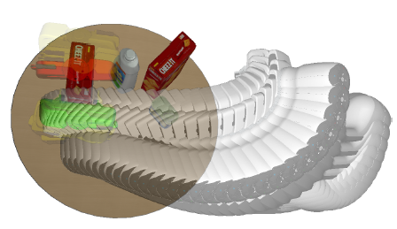
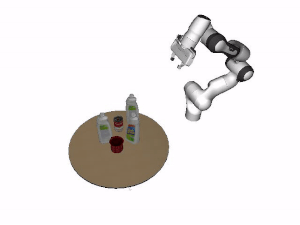
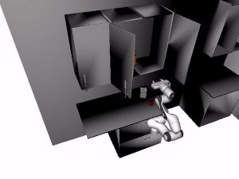
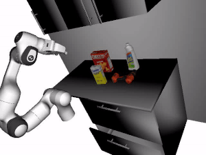
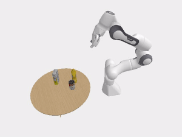
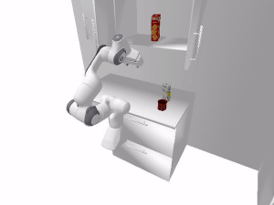

# OMG-Planner 
[[webpage](https://sites.google.com/view/omg-planner), [paper](https://arxiv.org/abs/1911.10280)]




### Installation
```bash
git clone https://github.com/liruiw/OMG-Planner.git --recursive
```

0. Setup: Ubuntu 16.04 or above, CUDA 10.0 or above

1. Install [anaconda](https://docs.anaconda.com/anaconda/install/) and create the virtual env for python 2 / 3
 
    ```angular2html
    conda create --name omg python=3.6.9/2.7.15
    conda activate omg
    pip install -r requirements.txt
    ``` 

2. Install [ycb_render](ycb_render)  

    ```Shell
    cd ycb_render
    python setup.py develop
    ```
 
3. Install the submodule Sophus. Check if the submodule is correctly downloaded.

    ```Shell
    cd Sophus
    mkdir build
    cd build
    cmake ..
    make -j8
    sudo make install
    ```


4. Install Eigen from the Github source code [here](https://github.com/eigenteam/eigen-git-mirror)

5. Compile the new layers under layers we introduce.
    ```Shell
    cd layers
    python setup.py install
    ```
6. Install the submodule PyKDL. Check this tutorial [here](https://git.ias.informatik.tu-darmstadt.de/lutter/ias_pykdl/blob/8b864ccf81763439ba5d45a359e1993208c2247c/pykdl.md) if there is any issue with installing PyKDL.

    ```bash
    cd orocos_kinematics_dynamics
    cd sip-4.19.3
    python configure.py
    make -j8; sudo make install
     
    export ROS_PYTHON_VERSION=3
    cd ../orocos_kdl
    mkdir build; cd build;
    cmake ..
    make -j8; sudo make install
      
    cd ../../python_orocos_kdl
    mkdir build; cd build;
    cmake ..  -DPYTHON_VERSION=3.6.9 -DPYTHON_EXECUTABLE=~/anaconda2/envs/omg/bin/python3.6
    make -j8;  cp PyKDL.so ~/anaconda2/envs/omg/lib/python3.6/site-packages/
    ```
     

### Common Usage
0. run ```./download_data.sh``` for data (Around 600 MB).
1. Run the planner to grasp objects.
 
python -m omg.core -v -f demo_scene_0         |  python -m omg.core -v -f demo_scene_1
:-------------------------:|:-------------------------:
  |  

python -m real_world.trial -s  script.txt  -v  -f kitchen0        |  python -m real_world.trial -s  script2.txt -v  -f kitchen1 
:-------------------------:|:-------------------------:
  |  

2. Loop through the 100 generated scenes and write videos. 
    ```Shell
    python -m omg.core -exp -w  
    ```
 
### PyBullet Experiments and Demonstrations
0. Install PyBullet `pip install pybullet gym` (build with eglRender for faster rendering)

1. Run planning in PyBullet simulator
 
python -m bullet.panda_scene -v -f demo_scene_2        |  python -m bullet.panda_scene -v -f demo_scene_3
:-------------------------:|:-------------------------:
  |  

python -m bullet.panda_kitchen_scene -v -f kitchen0       |  python -m bullet.panda_kitchen_scene -v -f kitchen1 -s script2.txt
:-------------------------:|:-------------------------:
  |  
  
2.  Loop through the 100 generated scenes and write videos. 
    ```Shell
    python -m bullet.panda_scene -exp -w 
    ```

3. Generate demonstration data data/demonstrations.
    ```Shell
    python -m bullet.gen_data -w 
    ```

4. Visualize saved data. 
    ```Shell
    python -m bullet.vis_data -o img
    ```

### Process New Shape  
0. To process shape, one would need [SDFGen](https://github.com/christopherbatty/SDFGen), [blenderpy](https://pypi.org/project/bpy/), [VHACD](https://github.com/bulletphysics/bullet3/tree/master/Extras/VHACD). 

1. Generate related files for your own mesh. (.obj file in data/objects/)
    ```Shell
    python -m real_world.process_shape -a -f box_box000
    ```

2. [Graspit](https://graspit-simulator.github.io/build/html/installation_linux.html) can be used to generate grasps with this [ros_package](https://github.com/JenniferBuehler/graspit-pkgs) and the [panda gripper](https://drive.google.com/file/d/1v2kAkktjmeXVnPVTdkEkIbsWb958qNvw/view?usp=sharing). Then save the poses as numpy or json files to be used in OMG Planner. Alternatively one can use [DexNet](https://github.com/BerkeleyAutomation/dex-net) or direct physics simulation in Bullet.

### File Structure 
```angular2html
├── ...
├── OMG
|   |── data
|   |   |── grasps      # grasps of the objects
|   |   |── objects     # object meshes, sdf, urdf, etc
|   |   |── robots      # robot meshes, urdf, etc
|   |   |── demonstrations  # saved images of trajectory
|   |   └── scenes      # table top planning scenes
|   |── bullet
|   |   |── panda_scene     # tabletop grasping environment 
|   |   |── panda_kitchen_scene # pick-and-place environment for the cabinet scene
|   |   |── panda_gripper   # bullet franka panda model with gripper
|   |   |── gen_data        # generate and save trajectories 
|   |   └── vis_data        # visualize saved data
|   |── layers          # faster SDF queries with CUDA
|   |── omg                 # core algorithm code
|   |   |── core        # planning scene and object/env definitions
|   |   |── config          # config for planning scenes and planner
|   |   |── planner         # OMG planner in a high-level 
|   |   |── cost        # different cost functions and gradients
|   |   |── online_learner  # goal selection mechanism
|   |   |── optimizer       # chomp and chomp-project update
|   |   └── ...
|   |── real_world               # auto-encoder networks
|   |   |── trial            # cabinet environment with an interface
|   |   |── process_shape    # generate required file from obj
|   |   └── ...
|   |── ycb_render               # headless rendering code
|   |   |── robotPose            # panda-specific robot kinematics 
|   |   └── ...
|   └── ...
└── ...
```
 
### Note
0. The config parameters are not perfectly tuned and there can be some stochasty in the goals and plans.
1. The grasp optimization code is not used since the grasps are mostly good (standoff pregrasp is used).
2. Please use Github issue tracker to report bugs. For other questions please contact [Lirui Wang](mailto:wangliruisz@gmail.com).

### Citation
If you find OMG-Planner useful in your research, please consider citing:
```
@inproceedings{wang2020manipulation,
  title={Manipulation Trajectory Optimization with Online Grasp Synthesis and Selection},
  author={Wang, Lirui and Xiang, Yu and Fox, Dieter},
  booktitle={Robotics: Science and Systems (RSS)},
  year={2020}
}
```


## License
The OMG Planner is licensed under the [MIT License](LICENSE).
