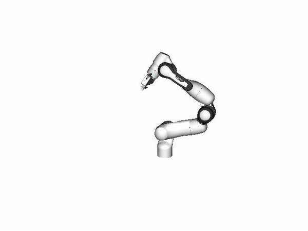
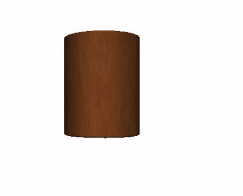

# YCB Renderer

This is an PyOpenGL version of YCB renderer, it has some key features to work 
with deep learning frameworks. This renderer is created by Fei Xia (feixia@stanford.edu) and modified by Lirui Wang (liruiw@uw.edu) and Yu Xiang 
(yux@nvidia.com).
- EGL headless rendering, so a running x server is not required
- Rendering to multiple texture buffers, so it can render rgb, segmentation,
point cloud in a single shader call
- Uses OpenGL - CUDA interoperation to render to pytorch tensor directly and can render 1024x1024 images at 1300 fps.
- Support `eglQueryDevicesEXT` and `eglGetPlatformDisplayEXT` via `pybind11`. So it
is easy to choose which GPU to use.
- Minimalistic, it uses raw OpenGL, doesn't rely on third-party GL helper libraries other than 
`assimp`. 
- It supports rendering of textured structured objects and simple geometry such as points/lines as well as other features.
- It uses cv2 as a minimal interactive app for mouse/keyboard control. 
- Parallelism is used to speed up loading.

       

## Installation 
Install dependencies:

```bash
sudo apt-get install libassimp-dev
```

In a virtual environment, run `python setup.py develop` should compile c++ sources
and setup paths.

 
## Example
Run ```./download_data.sh``` in the root directory of the OMG package to download necessary data.

`python ycb_renderer.py ycb` for rendering YCB objects

`python ycb_renderer.py panda_arm`  for rendering Franka Panda arm model  

`python ycb_renderer.py shapenet`  for rendering an example shapenet mug 

or aribitray path to the model directory or .obj file or lists of objects (split by ,) of you like with `python ycb_renderer.py ../data/objects/002_master_chef_can/,../data/objects/003_cracker_box/`. 
Mouse window interaction:
 ```
(control + left) to rotate
(control + middle) to translate 
(shift + left) to zoom  
 ```

Keyboard window interaction:
 ```
'esc' to quit
's' to interact
'n' to acquire camera pose
'x' to reset camera
'q' to tilt up
'e' to tilt down
'a' to pan left
'd' to pan right
'z' to zoom out 
'c' to zoom in 
'w' to toggle background color
'p' to take snapshot
'v' to toggle video recording
'i,k,j,l,m,<,r' to change object pose
'tab' to switch color, segmentation, normal, and points 
'`' to toggle wireframe and point
'1' to toggle vertex normal drawing
'2' to capture observed points
'3' to aggregate capture observed points
'space' to render coordinate axis
```
python ycb_renderer.py panda_arm    |    python ycb_renderer.py shapenet2
:-------------------------:|:-------------------------:|  
  |      

python ycb_renderer.py ycb    |    python ycb_renderer.py shapenet
:-------------------------:|:-------------------------:| 
  |      


      

 

